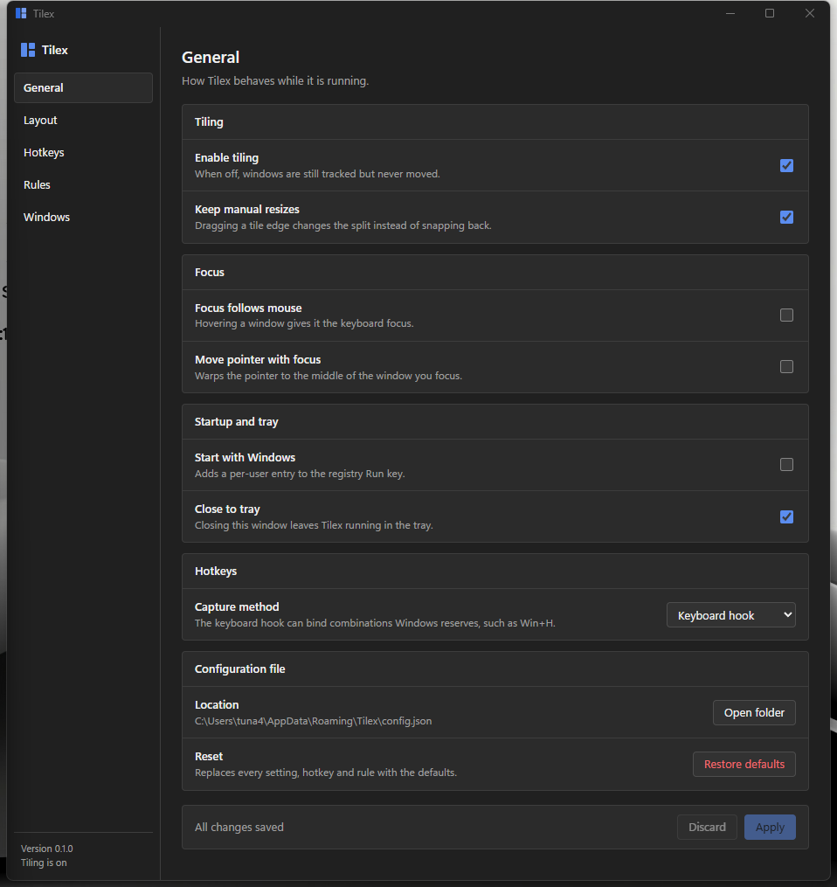

# Tilex

Auto-tiling window manager for Windows.

Tilex watches the desktop through the Win32 event hooks, keeps track of every
manageable top-level window and re-tiles them whenever something opens, closes
or moves. The window management runs entirely in Rust on its own message-loop
thread; Tauri only provides the settings window and the tray icon.

- One window fills the work area, two split it in half, and beyond that the
  screen is cut recursively so every window ends up with roughly the same area.
- Every display gets its own window list, layout and split ratios.
- Windows can be floated per application through a rule, or one at a time with
  a hotkey.
- Dragging a tile edge changes the split behind it instead of being undone on
  the next pass, so manual resizing sticks.



## Building

```
npm install
npm run tauri dev      # development
npm run tauri build    # installers land in target/release/bundle
```

Requires Rust (stable, MSVC toolchain), Node 18 or newer, and the WebView2
runtime, which ships with Windows 11.

The window management can also be run on its own, without any UI:

```
cargo run -p tilex-core --example headless -- 30
cargo run -p tilex-core --example list_windows
```

## Default hotkeys

| Binding                    | Action                                     |
| -------------------------- | ------------------------------------------ |
| `Win` + `H` `J` `K` `L`    | Move the focus left, down, up, right       |
| `Win` `Shift` + `H`…`L`    | Swap the focused window with its neighbour |
| `Win` `Ctrl` + `H`…`L`     | Grow the focused window that way           |
| `Win` `Ctrl` + `←` `→`     | Send the window to the next display        |
| `Win` + `Tab`              | Focus the next window                      |
| `Win` + `Enter`            | Promote the window to first place          |
| `Win` + `Space`            | Switch to the next layout                  |
| `Win` `Shift` + `Space`    | Float or unfloat the focused window        |
| `Win` `Shift` + `M`        | Mirror the layout                          |
| `Win` `Shift` + `R`        | Forget every manual resize on this display |
| `Win` `Ctrl` + `T`         | Pause or resume tiling                     |
| `Win` `Shift` + `Q`        | Minimize the focused window                |

To shrink a window, grow it in the opposite direction.

Windows reserves most `Win`+letter combinations for the shell, and
`RegisterHotKey` refuses them. Tilex therefore captures its bindings with a
low-level keyboard hook by default, which sees the key first and swallows it.
The General page can switch to `RegisterHotKey` instead; the Hotkeys page then
marks whatever Windows would not hand over.

## Layouts

| Layout           | Shape                                                       |
| ---------------- | ----------------------------------------------------------- |
| Binary split     | Recursive halving along the longer side. The default.       |
| Columns / Rows   | Equal strips.                                               |
| Main and stack   | One large window plus the rest, in the style of dwm.        |
| Monocle          | Every window fills the screen; only the focused one shows.  |

The layout is picked per display, from the tray menu or with `Win`+`Space`.
Adding a new one means implementing `LayoutAlgorithm` in `crates/tilex-core/src/layout`
and adding a variant to `LayoutKind`; reporting the split edges is what lets a
manual resize be folded back in.

## Configuration

`%APPDATA%\Tilex\config.json`, written by the settings window and re-read when
it is saved. A missing or partly filled file is fine: every field falls back to
its default.

Rules decide what happens to a window, matched from the top with the first hit
winning:

```json
{
  "rules": [
    { "process": "taskmgr.exe", "action": "float" },
    { "class": "#32770", "action": "float" },
    { "process": "code.exe", "title-contains": "Settings", "action": "ignore" }
  ]
}
```

`tile` puts the window in the layout, `float` leaves its position alone, and
`ignore` makes Tilex pretend it does not exist. A rule can also pin an
application to a display with `"monitor": 1`.

## Notes

- Starting with Windows is a per-user entry under the `Run` registry key, so
  turning it on never asks for elevation.
- Elevated windows cannot be moved by a normal process. Run Tilex as
  administrator if you need it to manage them.
- Only one instance can run at a time; launching Tilex again just brings the
  settings window back.

## License

MIT
